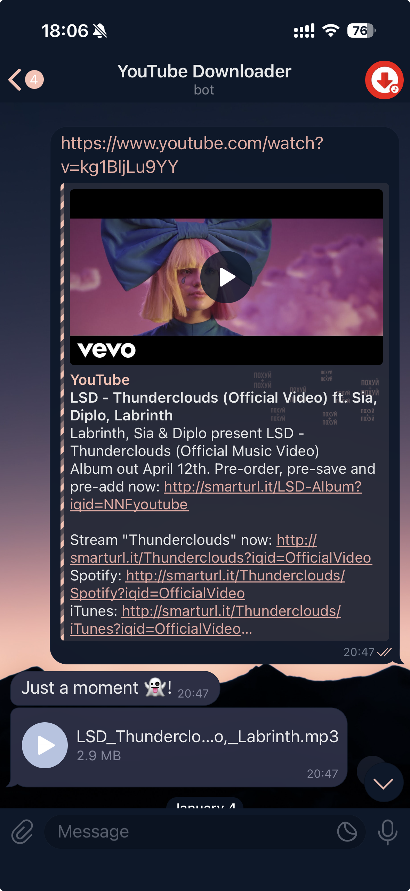

# YouTube Downloader Bot

A lightweight Go-based Telegram bot that extracts and downloads audio from YouTube links.

[](https://go.dev)

[](https://railway.app)
[](https://nixpacks.com)

## Preview

<p align="center">
  
</p>

## Features
- Paste a YouTube URL in Telegram → receive an audio file MP3.
- Simple command flow and minimal dependencies.
- Production-ready container build via Nixpacks.
- Easy one‑click deployment to Railway.

## Architecture
- Language: Go (100%)
- Clients: `clients/telegram` – Telegram bot interactions
- Core: `consumer`, `events`, `lib` – event handling and audio extraction
- Config: `config` – environment variables and application settings
- Entry point: `main.go`
- Build: `nixpacks.toml` for reproducible builds

## Prerequisites
- Go 1.22+
- Telegram Bot Token from @BotFather
- FFmpeg
- Optional: Railway account for deployment

## Configuration
Set environment variables:
- `TELEGRAM_BOT_TOKEN` – token from @BotFather

## Local Development
1. Clone the repository:
```
git clone https://github.com/teenagelove/yt-downloader.git
cd yt-downloader
```

2. Ensure `FFmpeg` is installed and available in PATH.

3. Run:
```
go mod download
go run ./...
```

4. Send a YouTube link to your bot in Telegram and receive audio back.

## Deploy to Railway
- This project is ready for Railway deploy with Nixpacks.
- Steps:
  1. Create a new Railway project and connect the GitHub repo.
  2. Set the environment variable `TELEGRAM_BOT_TOKEN`.
  3. Railway will detect `nixpacks.toml` and build automatically.
  4. Deploy and check logs to confirm the bot is running.

## Nixpacks
The `nixpacks.toml` specifies required packages for a reproducible build. Adjust it to include any additional system utilities your flow requires.

## Commands (Bot usage)
- Send a message containing a YouTube URL. The bot:
  - Validates the link
  - Extracts audio
  - Sends the audio file back to the chat
- Future commands (ideas):
  - `/help` – show usage info
  - `/start` – start bot

## Project Structure
```
.
├── clients/telegram       # Telegram client & handlers
├── config                 # App configuration
├── consumer               # Core consumption & processing
├── events                 # Event definitions/dispatch
├── lib                    # Utilities & helpers
├── main.go                # Entry point
├── nixpacks.toml          # Nixpacks build config
└── README.md
```
